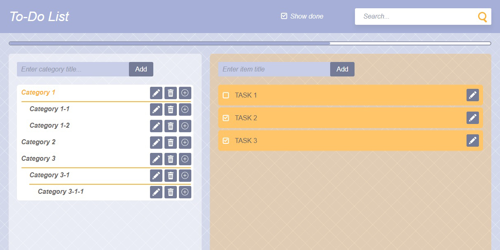
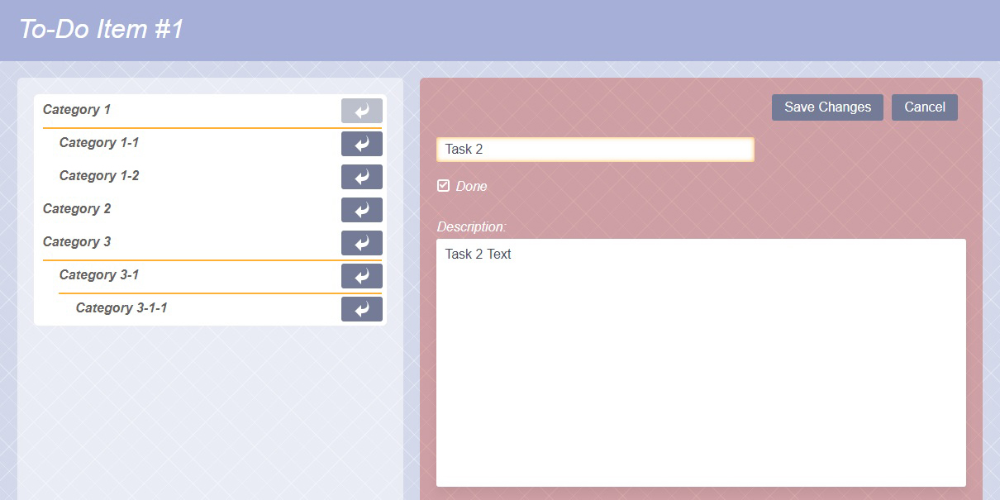

# TODO List App
<p>Simple app for adding categories with tasks inside.</p>
<p>Created using React JS 16+ and React Roter 4.</p>

## Features:
* Add/Delete/Rename categories
* Add/Edit tasks
* Show Done Filter
* Search among tasks
* Progress bar displays state of each category
* Transfer task between categories in Edit Task Mode

## Installation
```
  $ npm install
  $ npm run dev-server
```

Open `http://localhost:8080` in the browser and enjoy.

## Screenshots


